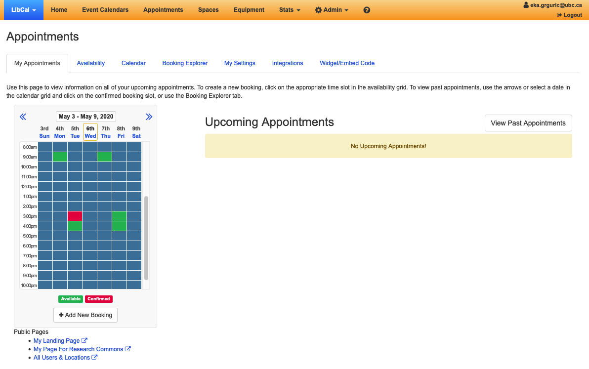
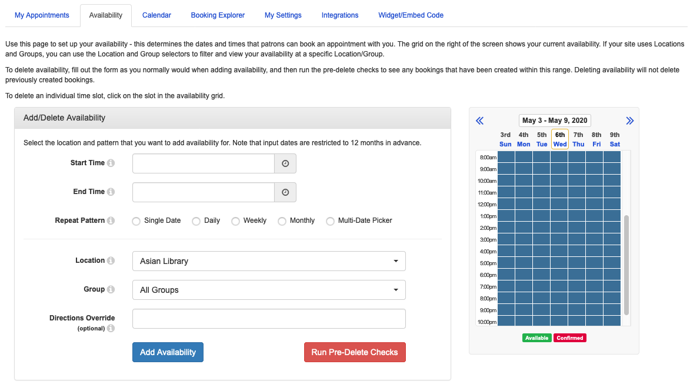
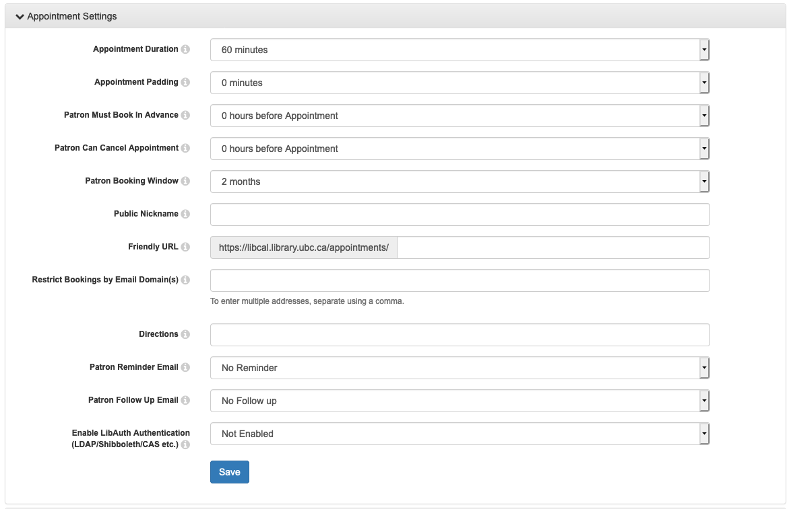

# Setting up consults in LibCal

We use the LibCal appointments module.

1. Log in to LibCal here

You should see an appointments tab in the main menu:

If you do not see this tab reach out to your team lead or Sarah.

2. The Appointments landing page looks like this:

This is where you can quickly see a list of upcoming appointments, delete appointments, and book additional appointments as necessary.

3. Setting your Availabiliyt.

Things to keep in mind:
*

4. Customizing default settings under "My Settings". Any changes made here are unique to you and don't affect other users of LibCal appointments.

The default settings are:

Each team should connect with their team lead about adding additional questions to the booking form.
