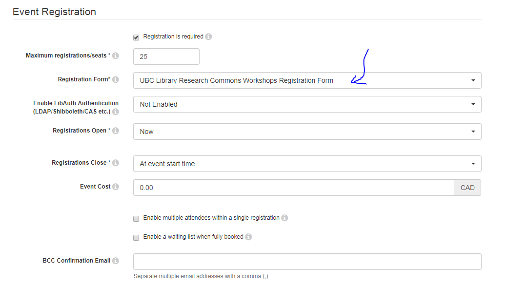
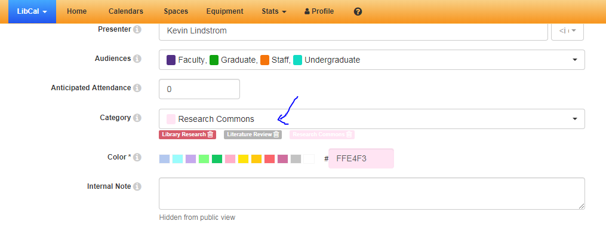

# Getting a UBC Education Zoom account
1. You will need a UBC Zoom account to lead workshops so that your workshop length is unlimited and you can lead up to 300 participants. Go to this link:
<a href="https://ubc.service-now.com/selfservice?id=sc_cat_item&sys_id=cc7f5fb9874e0100bbee70406d434df9" target="_blank">https://ubc.service-now.com/selfservice?id=sc_cat_item&sys_id=cc7f5fb9874e0100bbee70406d434df9</a>.     

Note: You will be prompted for your CWL and password.    

The Zoom account will be setup within about 2 business days. If you are waiting longer than this, please contact [research.commons@ubc.ca](mailto:research.commons@ubc.ca) email for follow up.    

# Assigning roles with teaching pairs
In the teaching pair, or teaching group, you need to first figure out who will be Host and who will be Co-host. 

## Host responsibilities
1. Create the Zoom link and provide to your team lead (Allan Cho, Eka Grguric, Jeremy Buhler, Evan Thornberry), they can add the link to your event invite in LibCal.
2. Add attendees from the waitroom into the main session.
3. Take screenshots of the participant pane at approximately the 15 minute mark for attendance. 
4. Monitor the chat and participant pane for raised hands and other commentary.

## Host responsibilities
1. Create the Zoom link and provide to your team lead (Allan Cho, Eka Grguric, Jeremy Buhler, Evan Thornberry), they can add the link to your event invite in LibCal.
2. Add attendees from the waitroom into the main session.
3. Take screenshots of the participant pane at approximately the 15 minute mark for attendance. 
4. Monitor the chat and participant pane for raised hands and other commentary.
5. Sarah and Brett will monitor the research.commons@ubc.ca email to check if anyone is having trouble logging into the workshop.

## Co-host responsibilities
1. Congratulations! You are presenting / teaching the workshop / webinar content. 
2. Welcome attendees.
3. Orient attendees to location of webinar website, slides, and other materials.
4. Orient attendees to Zoom features.  Check out Jeremy Buhler's page for orienting attendees to Zoom features:  <a href="https://ubc-library-rc.github.io/intro-api/online.html" target="_blank">https://ubc-library-rc.github.io/intro-api/online.html</a>

# Recommended Zoom settings
1. Make sure you have the following settings:
  * Meeting ID > Generate Automatically
  * Video Host and Video Participant set to off.
    
1. Also, make sure both of these are on:
  * Mute participants upon entry
  * Enable waiting room
    

# LibCal workshop setup for Zoom workshops
These instructions assume you are using the online Zoom website but similar steps can be replicated in desktop Zoom.
1. Two weeks before your workshop, generate a Zoom link for your workshop at <a href="https://zoom.us/meeting" target="_blank">https://zoom.us/meeting</a>    

Note: If you have more than one Zoom account, make sure that you create this workshop with your UBC account.

but 

Make sure you have the following settings:

  * Meeting ID > Generate Automatically
  * Video Host and Video Participant set to off.
    
1. Also, make sure both of these are on:
  * Mute participants upon entry
  * Enable waiting room
    

1. For events to appear in the Graduate Community Calendar <a href="https://community.grad.ubc.ca/calendar" target="_blank">https://community.grad.ubc.ca/calendar</a>, they need to be manually copied by the UBC Library Research Commons Program Coordinator. Typically all of the events that are in LibCal for Graduate Students are all copied into this calendar once per semester. This usually happens when the GAA led workshop schedule is locked-down. For example, this happened in mid December for the January schedule. It is typically about 1 month before the start of a given semester. Missed the mass copy? Simply let the UBC Library Research Commons Program Coordinator know you need an individual event copied to the Graduate Calendar.
1. Since you are the owner of the event, only you have access to the registration data for the event. If you used the UBC Library Research Commons Workshops registration form in step 1, you will need to share this information with the UBC Library Research Commons Program Coordinator so that anyone who subscribes to the UBC Library Research Commons newsletter actually receives the newsletter as promised. Simply download and email the Excel spreadsheet associated with your event by going to Manage Event > Registrations tab and click the Excel button to download the Excel spreadsheet.

https://ubc.service-now.com/selfservice?id=sc_cat_item&sys_id=cc7f5fb9874e0100bbee70406d434df9

Checklist for setting up Grad Student events in LibCal:
- \[ ] Picked the UBC Library Research Commons Workshops Registration Form to capture faculty / unit and also subscriptions to RC newsletter.
- \[ ] Tagged the workshop with Research Commons category.
- \[ ] Let UBC Library Research Commons coordinator know if it should appear in the Grad Community Calendar.
- \[ ] After workshop downloaded Excel sheet of new newsletter subscribers and submitted to UBC Library Research Commons Coordinator.

1. You can set the Registration Form for your event when creating it (optimal) or you can Modify your event later to switch the Registration Form. You need to select UBC Library Research Commons Workshops Registration Form from the Registration Form drop-down.

1. Select Research Commons as the category for your event. This way your event will appear in the link sent out with the Reseearch Commons newsletter. 

1. For events to appear in the Graduate Community Calendar <a href="https://community.grad.ubc.ca/calendar" target="_blank">https://community.grad.ubc.ca/calendar</a>, they need to be manually copied by the UBC Library Research Commons Program Coordinator. Typically all of the events that are in LibCal for Graduate Students are all copied into this calendar once per semester. This usually happens when the GAA led workshop schedule is locked-down. For example, this happened in mid December for the January schedule. It is typically about 1 month before the start of a given semester. Missed the mass copy? Simply let the UBC Library Research Commons Program Coordinator know you need an individual event copied to the Graduate Calendar.
1. Since you are the owner of the event, only you have access to the registration data for the event. If you used the UBC Library Research Commons Workshops registration form in step 1, you will need to share this information with the UBC Library Research Commons Program Coordinator so that anyone who subscribes to the UBC Library Research Commons newsletter actually receives the newsletter as promised. Simply download and email the Excel spreadsheet associated with your event by going to Manage Event > Registrations tab and click the Excel button to download the Excel spreadsheet.

https://ubc-library-rc.github.io/intro-api/online.html
