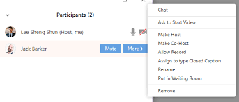

# Getting a UBC Education Zoom account
1. You will need a UBC Zoom account to lead workshops so that your workshop length is unlimited and you can lead up to 300 participants. Go to this link:
<a href="https://ubc.service-now.com/selfservice?id=sc_cat_item&sys_id=cc7f5fb9874e0100bbee70406d434df9" target="_blank">https://ubc.service-now.com/selfservice?id=sc_cat_item&sys_id=cc7f5fb9874e0100bbee70406d434df9</a>.     

Note: You will be prompted for your CWL and password.    

The Zoom account will be setup within about 2 business days. If you are waiting longer than this, please contact [research.commons@ubc.ca](mailto:research.commons@ubc.ca) email for follow up.    

# Recommended Zoom settings
1. Make sure you have the following settings:
  * Meeting ID > Generate Automatically
  * Video Host and Video Participant set to off.
    
1. Also, make sure both of these are on:
  * Mute participants upon entry
  * Enable waiting room
     
1. Enable the Waiting Room and also do a bug work around so that the Waiting Room messaging looks correct following these steps.
  * In your Zoom settings (<a href="https://zoom.us/profile/setting" target="_blank">https://zoom.us/profile/setting</a>), enable Waiting Room. 

  * Now the pencil icon to the right of Customize the title, logo, and description.
  * Now click on Add waiting room description (even though you won't actually be adding a description).

  * Now click the check box and then Close the dialog.
  

# Recording your sessions / Privacy issues
  * Please do not record your sessions due to privacy concerns.
  * If your team (including your Team Lead) decides you should record a session, the co-host must announce at the beginning of the session that it is being recorded. Also, a note needs to be added in the meeting reminder to let participants know it will be recorded with the suggestion that participants only login with their first names. If you are in the middle of a workshop, participants can change their display name by clicking it in the Participants list.
  
  

# Roles and responsibilities
In the teaching pair, or teaching group, you need to first figure out who will be Host and who will be Co-host. 

## Host responsibilities
1. Create the Zoom link and provide to your team lead (Allan Cho, Eka Grguric, Jeremy Buhler, Evan Thornberry), they can add the link to your event invite in LibCal.
2. Add attendees from the waitroom into the main session.
3. Post links in the chat window that your co-host mentions. 
4. Take screenshots of the participant pane at approximately the 15 minute mark for attendance. 
5. Monitor the chat and participant pane for raised hands and other commentary.
6. Download screenshots of the whiteboards if you use this feature.

## Co-host responsibilities
1. Congratulations! You are presenting / teaching the workshop / webinar content. 
2. Welcome attendees.
3. Orient attendees to location of webinar website, slides, and other materials.
4. Orient attendees to Zoom features.  Check out Jeremy Buhler's page for orienting attendees to Zoom features:  <a href="https://ubc-library-rc.github.io/intro-api/online.html" target="_blank">https://ubc-library-rc.github.io/intro-api/online.html</a>

## Others Responsibilities
1. Allan Cho, Eka Grguric, Jeremy Buhler, Evan Thornberry will put the GAA's zoom link into the reminder email for the event.
2. Sarah Blay and Brett Dimond will be online for all workshop times in case emails come through [research.commons@ubc.ca](mailto:research.commons@ubc.ca).

# LibCal workshop setup for Zoom workshops
These instructions assume you are using the online Zoom website but similar steps can be replicated in desktop Zoom.
1. Two weeks before your workshop, generate a Zoom link for your workshop at <a href="https://zoom.us/meeting" target="_blank">https://zoom.us/meeting</a>    

